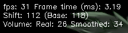

# FlynnyViz
In short, this script takes an input images and hue shifts it based off the current sound playing and a constant shift, making sort of an audio vizualizer

## Command Line Options
- -I, --image     Select image
- -T, --title     Allows you to change the name of the window (limited to ASCII)
- -s, --scale     Changes images scale in percentages
- -F, --fps_cap   Changes the default framerate cap

Smoothing
- -D, --dampening 
- -t, --timing     Takes one capture every Nth frame and every N*2th frame to mix together
- -x1, --weightx1  Weight of Nth frame
- -x2, --weightx2  Weight of N*2 frame

-S, --stats        Displays FPS, real frame time, hue-shift and volume level

- --shift          Constant hue shift, helps with some problematic images
- --only_audio     Only shift hue based off of audio
- --noclear        Do not clear console on window close

### TODO
- Provide a packaged version of the script, for both Windows and Linux
- Move away from PyAudio
- Fix some weird display issues with openCV (maybe even switch to a different library)
- Add UI for image selection, live changes, etc.
- clean up the code ~~(yeah, no)~~
